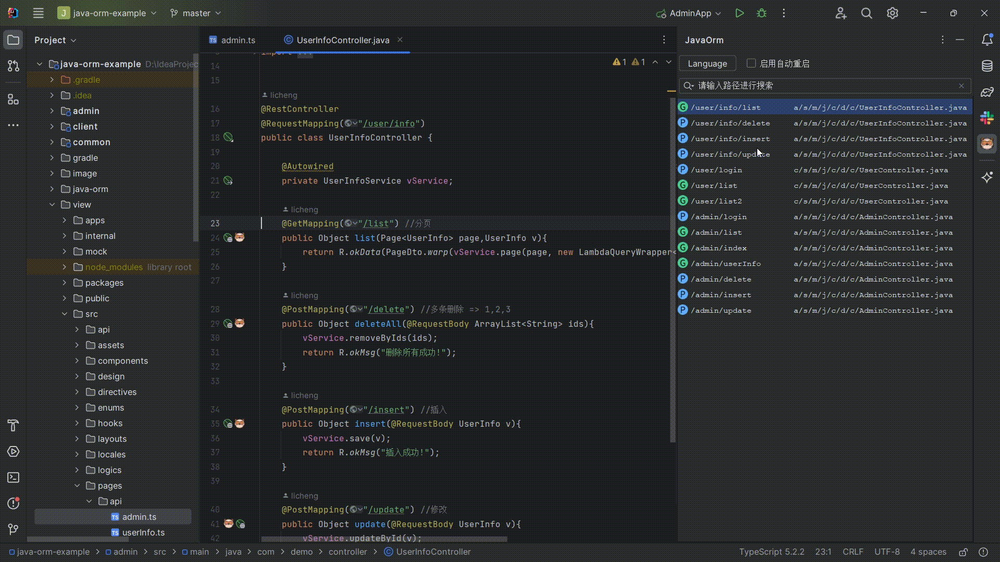
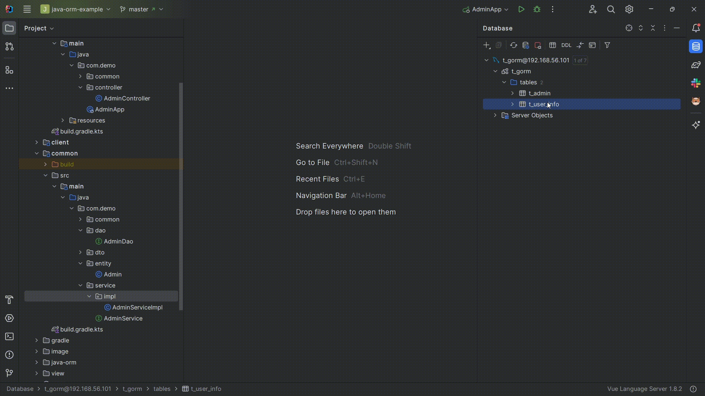
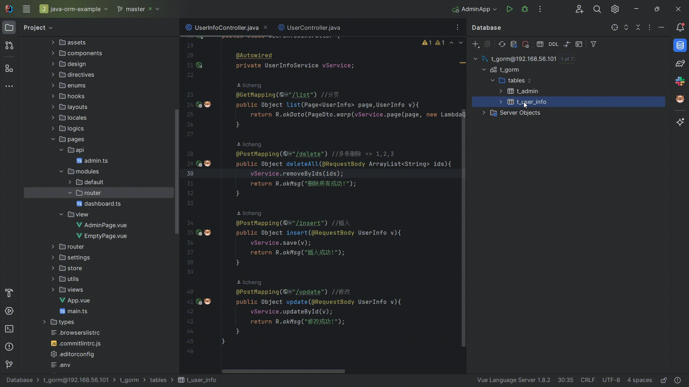
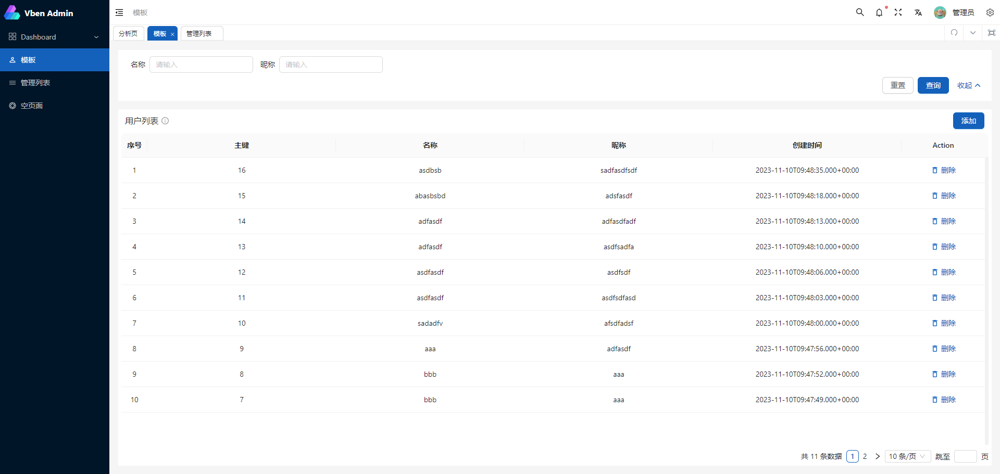

# JavaOrmExample

## 介绍

- 此项目是 `JavaOrm插件` 的演示项目同时也是一个 `后台项目的开始模板`
- 你可以通过插件来加速项目开发

- `插件下载地址：` [java-orm](https://plugins.jetbrains.com/plugin/20888-javaorm)

| 功能          | 可用 | 版本        | 额外说明            |
|-------------|----|-----------|-----------------|
| 增删改查生成      | 🆗 |           | 支持修改模板          |
| 路由导航        | 🆗 |           | 从URL路径直接跳转到对应文件 |
| 接口调试        | 🆗 |           | 在接口旁边直接发送请求     |
| java类转dart类 | 🆗 |           |                 |
| 前端请求代码生成    | 🆗 | 2023.8.8+ | 支持修改模板          |
| 前端模板代码生成    | 🆗 | 2023.8.9+ | 支持修改模板          |
| 文档导出        | ❌  |           |                 |

- ❌ 代表未完成，🆗 代表已完成
- 未完成原因可能是目前并未收到需要此功能的请求

## 演示示例

### 路由导航&路径复制&请求模板

- 路由导航: 导航到API的位置,
- 路径复制: 直接复制API的路径,
- 请求模板: 用于前端的请求模板,(支持自定义)

### 前后端代码生成

- 后端代码
- 
- 前端代码
- 

- 完全不需要您手动写任何一行代码即可完成此效果
- 

### 转换flutter代码

### 接口简单调试

## 项目技术整合

- 这是一个示例项目，但同时也是一个SpringBoot的后台管理项目起步
- 基本的工具类已经准备完毕。

| 技术            | 官网                                                   | 整合 |
|---------------|------------------------------------------------------|----|
| spring-boot   | [spring.io](https://spring.io/projects/spring-boot/) | 🆗 |
| mybatis-plus  | [baomidou.com](https://baomidou.com/)                | 🆗 |
| lombok        | [projectlombok.org](https://projectlombok.org/)      | 🆗 |
| hutool        | [hutool.cn](https://hutool.cn/)                      | 🆗 |
| mysql         | [www.mysql.com](https://www.mysql.com/cn/)           | 🆗 |
| alibaba-druid | [druid](https://github.com/alibaba/druid)            | 🆗 |
| jwt           | [java-jwt](https://github.com/auth0/java-jwt)        | 🆗 |
| cors          | 跨域处理                                                 | 🆗 |
| redis         |                                                      | ❌  |
| 多模块           |                                                      | 🆗 |

## 起步

- 1.克隆项目

### 后端

- jdk17+(jdk8没有试过), maven3.x+, mysql8.x+
- 1.创建数据库并导入sql进去
- 2.admin/src/main/resources/application.yml 修改数据库配置
- 3.运行 AdminApp.java 启动后端项目

### 前端

- node v16.20+
- 1.view目录下 pnpm install 安装依赖
- 2.view目录下 pnpm dev 启动项目
- 3.view目录下 pnpm run build 打包项目

