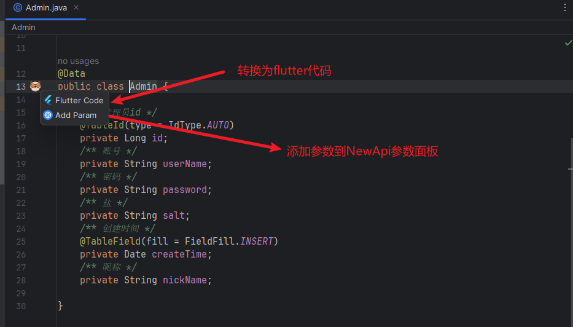
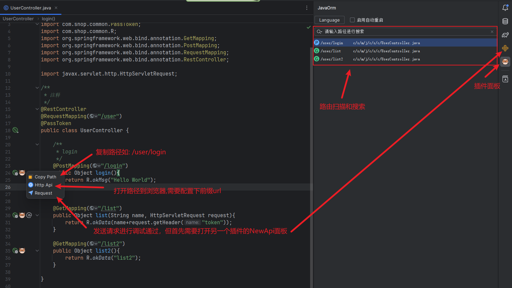
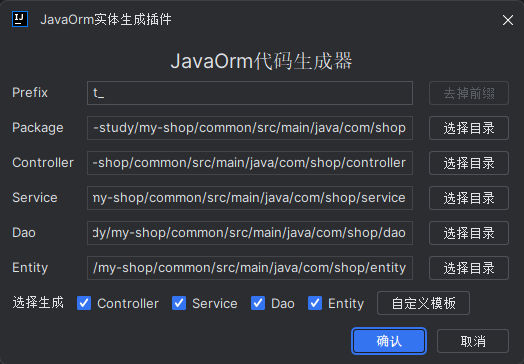

# JavaOrmExample

## 介绍

- java-orm插件的示例项目
- 下载地址：[java-orm](https://plugins.jetbrains.com/plugin/20888-javaorm)

| 功能          | 可用 |
|-------------|----|
| 自定义模板生成增删改查 | 🆗 |
| 路由导航        | 🆗 |
| 接口调试        | 🆗 |
| java类转dart类 | 🆗 |
| 客户端请求模板     | ❌  |
| 文档导出        | ❌  |

- ❌ 代表未完成，🆗 代表已完成
- 未完成原因可能是目前并未收到需要此功能的请求

## 示例图片

- 
- 
- 
- 

## 项目技术整合

- 这是一个示例项目，但同时也是一个SpringBoot的后端起步项目
- 基本的工具类已经准备完毕。

| 技术            | 官网                                                   | 整合 |
|---------------|------------------------------------------------------|----|
| spring-boot   | [spring.io](https://spring.io/projects/spring-boot/) | 🆗 |
| mybatis-plus  | [baomidou.com](https://baomidou.com/)                | 🆗 |
| lombok        | [projectlombok.org](https://projectlombok.org/)      | 🆗 |
| hutool        | [hutool.cn](https://hutool.cn/)                      | 🆗 |
| mysql         | [www.mysql.com](https://www.mysql.com/cn/)           | 🆗 |
| alibaba-druid | [druid](https://github.com/alibaba/druid)            | 🆗 |
| jwt           | [java-jwt](https://github.com/auth0/java-jwt)        | 🆗 |
| cors          | 跨域处理                                                 | 🆗 |
| redis         |                                                      | ❌  |

